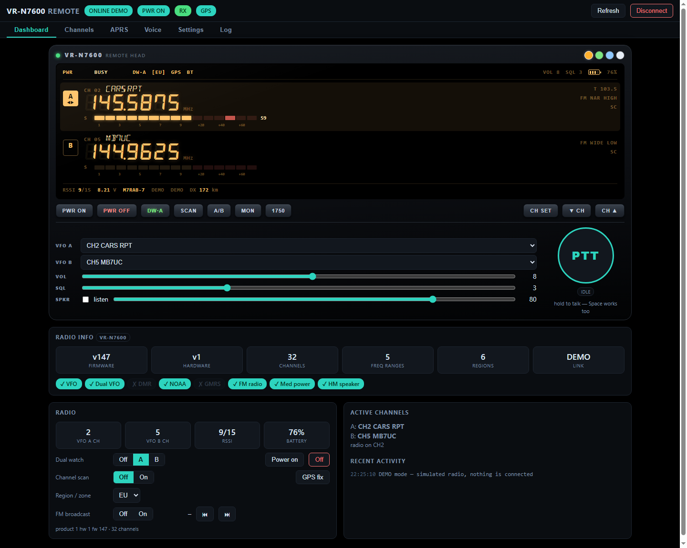
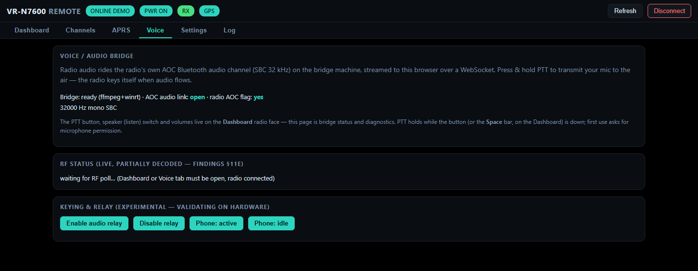
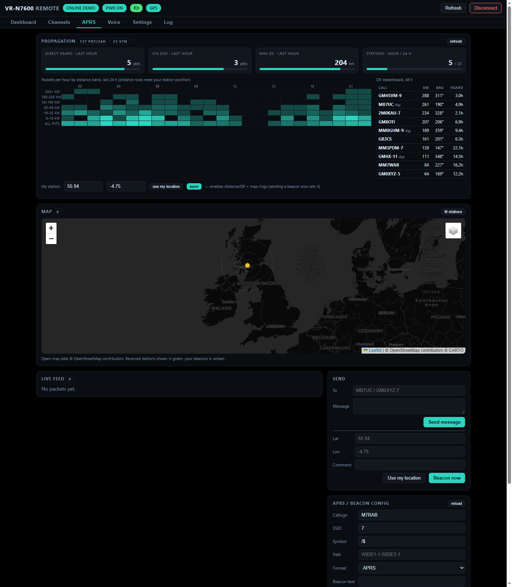
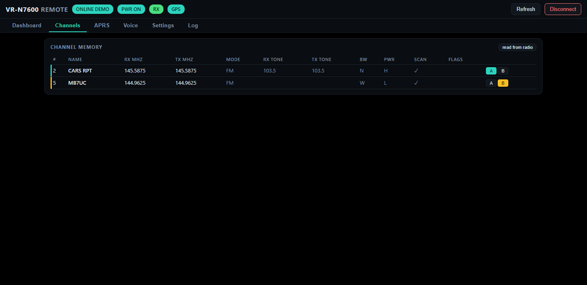
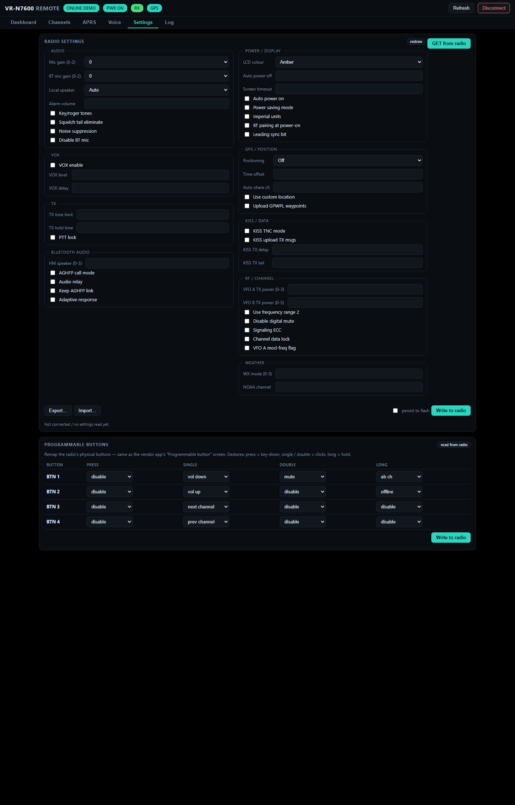
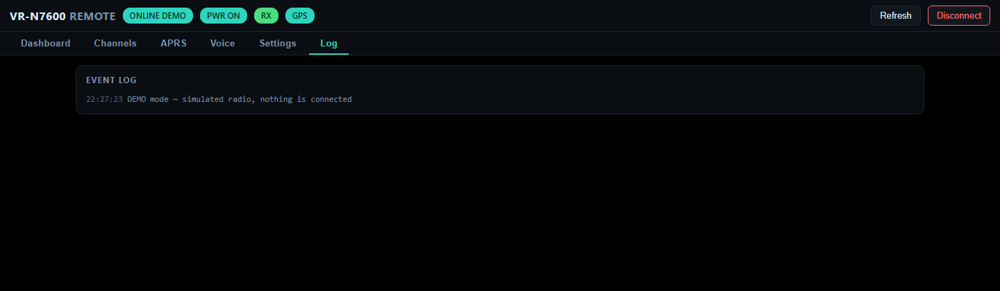

# KY-Benny(HTC)

**Web remote control for Benshi-protocol radios (VR-N7600 / BTECH UV-Pro
family).**

> ⚠️ **Work in progress.** This is a live reverse-engineering project —
> everything below works against real hardware (VR-N7600, fw 147, over
> Bluetooth from a Windows bridge machine), but interfaces change often,
> corners are rough, and some features are experimental. Expect breakage.
> Use at your own risk; nothing here is vendor-supported.

The bridge machine holds the Bluetooth link to the radio (the same
Benshi/GAIA command protocol the vendor app speaks) and serves a web UI,
so the radio can be operated from any browser — phone, tablet, PC — with
**no vendor app and no channel-binding to a second device**. The radio is
Bluetooth-only; this bridge is what puts it on the network.

## Features

### Dashboard — the whole radio on one face



- Virtual front panel: DSEG-style LCD with dual VFO rows, channel names,
  live 15-segment S-meter with peak hold (fed by the radio's own RSSI),
  battery/region/BUSY/TX icons, four LCD colours (amber/green/blue/white)
  and a true-black AMOLED-friendly theme.
- All operating controls live on the face: **PTT (press & hold, Space bar
  too)**, listen (RX) with browser volume, radio volume + squelch sliders,
  VFO A/B channel pick, dual watch, scan, A/B swap, monitor (open squelch),
  1750 Hz tone burst, channel editor, channel step, power on/off.
- TX lamp is properly disambiguated from the radio's ~5 s post-RX
  channel-hold quirk (live-RE'd; see `FINDINGS.txt` §11e).
- Remote wake: connecting can power on a soft-off radio (`wake_on_connect`).

### Voice over IP — talk and listen from the browser *(working, still maturing)*

- Radio audio rides its AOC Bluetooth channel (SBC, 32 kHz mono) through
  ffmpeg to the browser over a binary WebSocket — both directions.
- Press-and-hold PTT keys the radio from your browser mic; verified on-air
  both ways against real hardware. Windows bridge only for now; Linux port
  planned.



### APRS + propagation view *(new, in progress)*



- The radio's TNC data channel is decoded natively: positions (plain,
  compressed, **Mic-E**), messages, status, objects — live feed + map
  (Leaflet, light/dark tiles, offline-friendly vendored assets).
- Send APRS **messages**, **position beacons** (browser geolocation) and
  **status** straight through the radio.
- Full beacon/BSS config: callsign, SSID, symbol, digi path, interval,
  smart beacon, Mic-E, PTT-release beacons, packet format.
- **Propagation analytics** (inspired by
  [APRS-PropView](https://github.com/RF-YVY/APRS-PropView)): packets
  persist to a rolling 48 h history, and the panel shows direct-heard vs
  digipeated meters, max-DX meter, per-hour × distance-band heatmap, a DX
  leaderboard with bearings, and range rings on the map. A `DX n km` pill
  appears on the Dashboard face when something distant was heard in the
  last hour. Direct (no digi flag) copies are the band-opening signal.

### Channels



- Full memory table read from the radio: name, RX/TX frequency, mode,
  CTCSS/DCS tones, bandwidth, power, scan, flags.
- Editor writes everything back to the radio; per-row VFO A/B assign.

### Settings



- The radio's settings blocks, decoded and editable: audio/mic gains, VOX,
  TX limits, power/display, GPS/positioning, KISS TNC, RF/channel flags,
  weather — with optional persist-to-flash, and export/import.
- **Programmable buttons**: remap the radio's physical keys
  (press/single/double/long per button), same as the vendor app.

### Everything else



- Live updates over WebSocket (radio event notifications + polling).
- **Remote access**: single-token gate on the API + websockets — set
  `access_token` in `config.json` before port-forwarding/VPN.
- **Demo mode**: open `/?demo=1` for a simulated radio, no hardware needed.
- Debug/RE endpoints (`/api/debug/*`) and an event log for protocol work.

## Run

**From source** (any platform):

```
pip install -r requirements.txt
python app.py             # serves http://<bridge-machine>:8099
python launcher.py        # same, but opens its own window
```

**Desktop executable** (no Python needed): grab a release binary —
`windows-x64`, `linux-amd64` or `linux-arm64` (Pi 4/5 class) — or build
your own with `pip install pyinstaller pywebview && python build.py`.
Config, log and APRS history live next to the executable.

**Docker** (linux/amd64 + linux/arm64 images on GHCR):

```
docker compose up -d      # see docker-compose.yml
```

Bluetooth comes from the host, so the container runs with host networking,
`privileged` and the host D-Bus socket mounted (all set in the compose
file). Config and history persist in `./data/`.

Platform notes: **voice (AOC audio) is Windows-only for now** — it uses
WinRT; on Linux/Docker everything else (control, channels, settings, APRS,
propagation) works and voice reports "bridge unavailable". ffmpeg on the
PATH (or next to the exe) is needed for voice on Windows. A
`vrn7600.service` unit is included for systemd installs from source.

## First connect

1. Radio on, Bluetooth enabled (pairing mode only needed the very first
   time, for scanning).
2. Open the web UI → **Scan** → click the radio → **Connect** (or put its
   MAC / COM port in `config.json`).
3. Transports: BLE GATT, classic RFCOMM (GAIA/SPP) or a bonded serial COM
   port. One BT connection at a time — close the vendor app first.

## Status / roadmap

- [x] Full control surface (channels, settings, PF buttons, FM broadcast,
      regions), virtual LCD, live S-meter
- [x] Voice TX/RX over IP via the AOC audio channel (Windows bridge)
- [x] APRS decode/send + map
- [x] Propagation analytics (PropView-style) — **fresh, still being tuned**
- [x] Packaging: single-file executables (Windows/Linux amd64+arm64) and
      multi-arch Docker images via CI — **fresh, lightly tested**
- [ ] Linux/Pi port of the voice bridge
- [ ] DTMF keypad, VOX from browser, AudioWorklet migration
- [ ] Opus/WebRTC for low-bandwidth remote links
- [ ] KISS-over-IP bridge (radio has a KISS TNC mode)
- [ ] Firmware update (FOTA) — deliberately last: flash path is un-RE'd
      and is the one place a bad write can brick the radio

## Files

- `benshi.py` — protocol: GAIA/BLE framing, the 77-command set, bit-packed
  structs (dev info, channels, settings, HT status, position, BSS/APRS,
  TNC data fragmentation/reassembly).
- `aprs.py` — AX.25 UI-frame + APRS codec (positions, Mic-E, messages,
  status, objects).
- `prop.py` — propagation analytics: persistent packet history, distance/
  bearing, hourly heatmap, DX leaderboard.
- `radio.py` — async client: BLE GATT / RFCOMM / serial transports,
  request-reply matching, event notifications, APRS mixin.
- `audio.py` — AOC voice bridge: WinRT StreamSocket + ffmpeg SBC
  encode/decode pipes.
- `app.py` — FastAPI: REST + WebSocket push + static UI (port in
  `config.json`, default 8099).
- `CAPABILITIES.md` — the full button-for-button command matrix;
  `FINDINGS.txt` — the reverse-engineering lab notebook.

## Credits

This project stands on a combination of the efforts of
[Kyle Husmann, KC3SLD (khusmann)](https://github.com/khusmann/benlink) —
whose benlink project documented the Benshi command protocol — and
[Ylian Saint-Hilaire (Ylianst)](https://github.com/Ylianst/HTCommander) —
whose HTCommander proved full PC control including Bluetooth audio.
The propagation view is modelled on
[RF-YVY/APRS-PropView](https://github.com/RF-YVY/APRS-PropView).
Own-hardware interoperability project.
